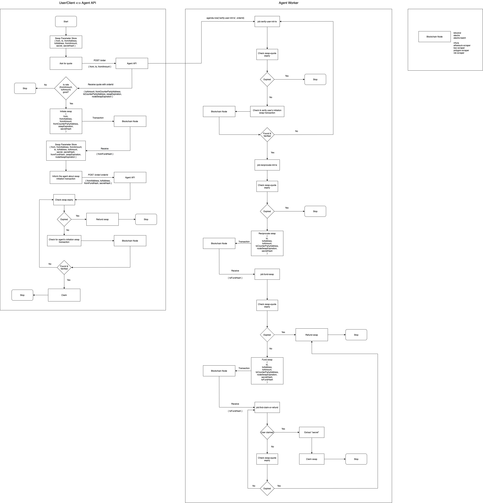

# 💥 Atomic Agent 


## Table of Contents

* [Introduction][section-introduction]
* [Prerequisites][section-prerequisites]
* [Installation][section-installation]
* [Usage][section-usage]
* [Test][section-test]
* [Liquality Hosted Agents][section-liquality-hosted-agents]
* [Liquality Nodes][section-liquality-nodes]
* [Run with Docker][section-run-with-docker]
* [User to Agent Swap Workflow][section-swap-workflow]
* [License][section-license]


## Introduction

The Atomic Agent service contains three utilities: `migrate`, `api`, `worker`. The API and worker utilities work together to provide the running service, while the migrate utility is utilized to initialize the database with market data.

The API and worker utilities are also distributed as Docker images:
* `atomicagent-api`
* `atomicagent-worker`

> Found here: https://github.com/orgs/liquality/packages?repo_name=atomicagent


## Prerequisites

1. Linux VM
2. node 14
3. mongoDB 4.2+
4. [RPC/API endpoints for the chains you want to support](#liquality-nodes)


## Installation

These instructions outline the standard installation process for the atomic agent:

```bash
git clone git@github.com:liquality/atomicagent.git
cd atomicagent
npm install
cp sample.config.toml config.toml   # copy sample config
nano config.toml                    # configure your agent settings
nano src/migrate/data/assets.json   # add/remove assets
nano src/migrate/data/markets.json  # add/remove markets
npm run migrate                     # prepare agent with assets & markets
```

## Usage

Ensure you have configured all settings for your scenario within the `config.toml` file you created at the root of the repo.

To run the utilities:

```bash
npm run api     # runs agent market maker api
npm run worker  # runs the background process
```


## Test

### Configure

```bash
cp sample.config.toml test.config.toml  # copy sample config
nano config.toml                        # configure your agent as per your test environment
```

### Run Automated Tests

```bash
chmod -R 777 test/docker/config
npm run docker:start
sleep 30                          # let bitcoind[regtest] mine first 100 blocks
npm run test
```


## Liquality Hosted Agents

|Environment | Network | Endpoint                                    |
|------------|---------|---------------------------------------------|
|Production  | Testnet | https://liquality.io/swap-testnet/agent     |
|Production  | Mainnet | https://liquality.io/swap/agent             |
|Development | Testnet | https://liquality.io/swap-testnet-dev/agent |
|Development | Mainnet | https://liquality.io/swap-dev/agent         |


## Liquality Testnet Nodes

| Node                  | Network | Endpoint                                               |
|-----------------------|---------|--------------------------------------------------------|
| Bitcoin Electrs       | Testnet | https://liquality.io/testnet/electrs                   |
| Bitcoin Batch Electrs | Testnet | https://liquality.io/electrs-testnet-batch             |
| Ethereum Scraper      | Testnet | https://liquality.io/eth-ropsten-api                   |
| RSK Scraper           | Testnet | https://liquality.io/rsk-testnet-api                   |
| BSC Scraper           | Testnet | https://liquality.io/bsc-testnet-api                   |
| Polygon Scraper       | Testnet | https://liquality.io/polygon-testnet-api/              |


## Liquality Mainnet Nodes

| Node                  | Network | Endpoint                                               |
|-----------------------|---------|--------------------------------------------------------|
| Bitcoin Electrs       | Mainnet | https://api-mainnet-bitcoin-electrs.liquality.io       |
| Bitcoin Batch Electrs | Mainnet | https://api-mainnet-bitcoin-electrs-batch.liquality.io |
| Ethereum Scraper      | Mainnet | https://liquality.io/eth-mainnet-api                   |
| RSK Scraper           | Mainnet | https://liquality.io/rsk-mainnet-api                   |
| BSC Scraper           | Mainnet | https://liquality.io/bsc-mainnet-api                   |
| Polygon Scraper       | Mainnet | https://liquality.io/polygon-mainnet-api/              |


## Run with Docker

The atomicagent service (which contains two utilities: api, worker) can each be dockerized for portability and convenience.

### Run the Atomic Agent Utilities Locally

To run the utilities locally as Docker containers, make a copy of the `sample.config.toml` at the root of the repo and name it: `config.docker.toml`. The Docker run commands provided will use this file for its configuration.

> **NOTE:** This configuration requires you to have your own MongoDB running.

> **TIP:** You can use the `config/local/run-mongodb.yml` config to run a simple MongoDB locally.

Ensure you have configured your desired markets and assets to run. The migrate utility will run automatically when the container starts, if the database is empty.

You can configure the markets and assets in the following files:

```
src/migrate/data/markets.json
src/migrate/data/assets.json
```

To run the API as a container locally:

| Command                   | Description                           |
| ------------------------- | ------------------------------------- |
| `docker:build-api-local`  | Builds the "atomicagent-api-local" image. |
| `docker:run-api-local`    | Runs the "atomicagent-api-local" image as a container. |
| `docker:log-api-local`    | Prints the standard out of the running "atomicagent-api-local" container. |
| `docker:stop-api-local`   | Stops the running "atomicagent-api-local" container. |

To run the worker as a container locally:

| Command                      | Description                           |
| ---------------------------- | ------------------------------------- |
| `docker:build-worker-local`  | Builds the "atomicagent-worker-local" image. |
| `docker:run-worker-local`    | Runs the "atomicagent-worker-local" image as a container. |
| `docker:log-worker-local`    | Prints the standard out of the running "atomicagent-worker-local" container. |
| `docker:stop-worker-local`   | Stops the running "atomicagent-worker-local" container. |


### Docker Image Settings

[TBC]

### Run the Full Swap System

The atomicagent service operates on multiple dependencies (for various chains/networks), as well as requiring a MongoDB to read/write data.

To run the full swap system in a contained environment (for testing purposes):

| Command                       | Description                           |
| ----------------------------- | ------------------------------------- |
| `docker:start-full-system`    | Builds and runs the "atomicagent-full-system" image and runs a local simulation of the supported agent services. |
| `docker:log-full-system`      | Prints the standard out of the running "atomicagent-full-system" container. |
| `docker:stop-full-system`     | Stops the running "atomicagent-full-system" container and the agent services. |

The config file is pre-configured for this scenario and is located at: `config/tester/config.tester.toml`


## User to Agent Swap Workflow




## License

[MIT](./LICENSE.md)


[section-introduction]: #introduction
[section-prerequisites]: #prerequisites
[section-installation]: #installation
[section-usage]: #usage
[section-test]: #test
[section-liquality-hosted-agents]: #liquality-hosted-agents
[section-liquality-nodes]: #liquality-nodes
[section-run-with-docker]: #run-with-docker
[section-swap-workflow]: #user-to-agent-swap-workflow
[section-license]: #license
